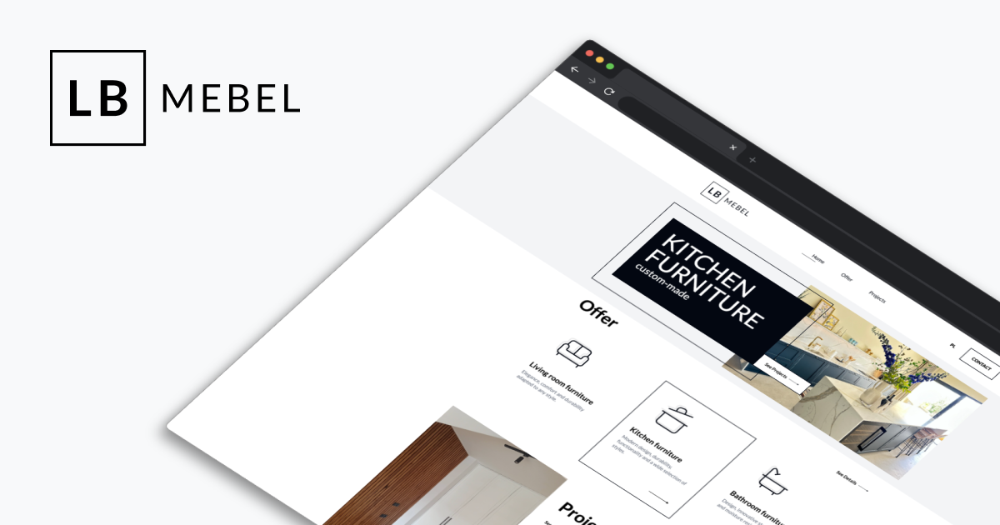

<picture>
  <source media="(prefers-color-scheme: dark)" srcset="images/logo_dark.png">
  
</picture>

# 

TECH<strong>STACK</strong>

##

WEB<strong>SITE</strong>

<a href="http://lbmebel.pl">`http://lbmebel.pl`</a>

##

CREATED<strong>BY</strong>

<a href="https://iwonauxui.pl/">`Iwona Kucharska`</a>

<a href="https://github.com/jaroslawkucharski">`Jarosław Kucharski`</a>

